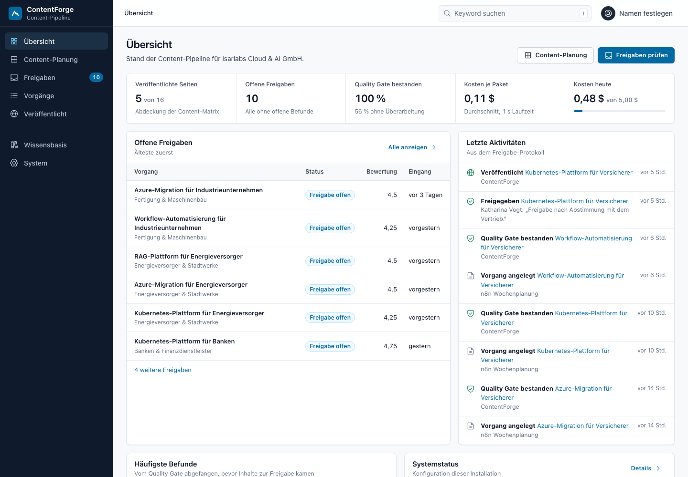
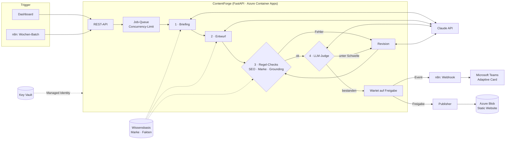
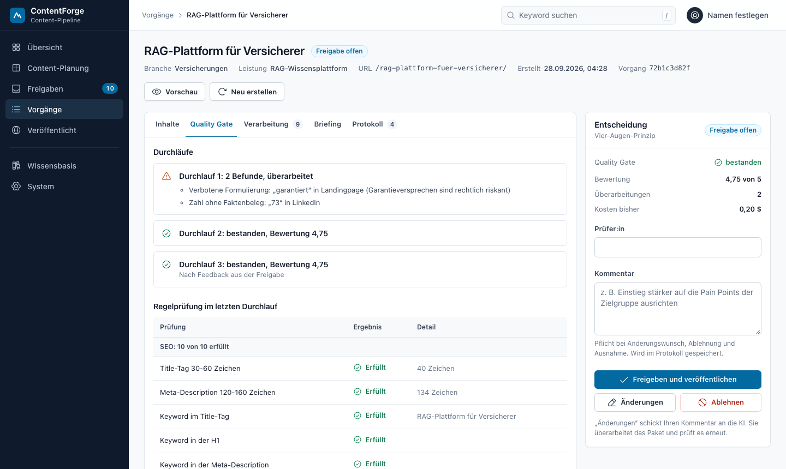
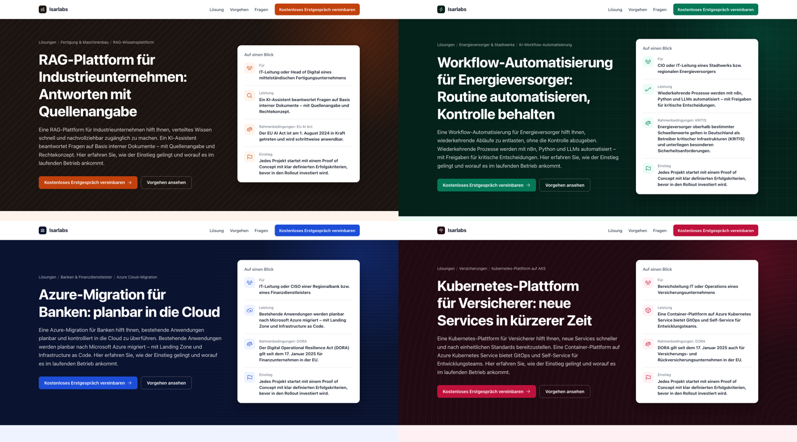

# ContentForge

**KI-Content-Pipeline für Programmatic SEO & B2B-Marketing.** Aus einer Matrix *Branche × Leistung*
erzeugt ContentForge je Zelle ein komplettes Content-Paket: eine SEO-Landingpage, einen LinkedIn-Post und
einen Newsletter-Teaser. Claude liefert die Texte. Ein Quality Gate prüft sie gegen Marke, SEO-Regeln und
die Faktenbasis, bevor ein Mensch freigibt und die Seite auf Azure veröffentlicht wird.



## Das Problem

B2B-IT-Dienstleister brauchen für jede Kombination aus Zielbranche und Leistung eigene, präzise Inhalte.
Bei 4 Branchen × 4 Leistungen sind das 16 Landingpages plus Social- und Newsletter-Varianten. Händisch
kostet das viel Zeit. Mit einem Chatbot „auf Zuruf“ entstehen typische Fehler: **erfundene Zahlen**,
Garantieversprechen, falsche Ansprache. Im Marketing regulierter Branchen ist das ein echtes Risiko.

## Was ContentForge macht

| Baustein | Umsetzung |
|---|---|
| **Programmatic SEO** | Keyword und URL werden deterministisch aus der Matrix abgeleitet, generativ ist nur der Text. Seiten mit Meta-Tags, Canonical, Open Graph, JSON-LD (`Service` + `FAQPage`), Sitemap und robots.txt |
| **Branchengerechte Seiten** | Jede Branche hat eigene Farbwelt, Hero-Muster, Icon und Regulierungsbezug (DORA, KRITIS, EU AI Act), jede Leistung eigenen Projektablauf und eine Referenz-Kennzahl. Alles stammt aus der Wissensbasis, ist also prüfbar statt generiert. Mobil-first umgesetzt |
| **Claude mit Structured Outputs** | `messages.parse()` mit Pydantic-Schemas, dadurch valides JSON ohne fragiles Parsen. Prompt Caching für Marke und Faktenbasis, Refusal-Fallback |
| **Quality Gate** | 21 deterministische Checks (SEO, Marke, Grounding, Kanal) + LLM-as-a-Judge (4 Kriterien, Schwellenwert) |
| **Schutz vor Halluzinationen** | Jede Zahl im Text muss wörtlich in einem Fakt stehen, den der Abschnitt selbst zitiert (`fact_ids`) |
| **Revisions-Loop** | Gefundene Probleme gehen gezielt zurück an Claude (max. 2 Revisionen), danach Status *Prüfung nötig* |
| **Freigabe-Workflow** | Vier-Augen-Prinzip: Freigeben, **Änderungen anfordern** (die KI setzt den Kommentar um und prüft erneut) oder Ablehnen. Kommentarpflicht bei Ablehnung und Ausnahme, lückenloses **Protokoll** (wer, wann, warum). n8n meldet offene Freigaben per Adaptive Card in Microsoft Teams |
| **Business-Oberfläche** | Übersicht, Content-Planung, Freigaben-Posteingang, Vorgänge mit Filtern und Sortierung, Veröffentlicht, Wissensbasis, System. Deutsch, tastaturbedienbar, deep-linkbar, offline-fähig, ohne Build-Schritt |
| **Automatisierung** | n8n-Workflows: wöchentlicher Content-Batch (Schedule) und Event-Benachrichtigungen (Webhook) |
| **Observability & Kosten** | Trace pro Schritt (Dauer, Modell, Tokens, USD), KPIs, **Tagesbudget als Kostenbremse** |
| **Evals** | Eval-Skript über die ganze Matrix; läuft in CI als Quality Gate |
| **Azure** | Container Apps, Container Registry, Key Vault, Managed Identity, Blob Static Website – alles als **Terraform**; Deployment per **GitHub Actions mit OIDC** |

## Architektur



**Warum ein Workflow und kein autonomer Agent?** Die Schritte sind bekannt und stabil. Also legt der Code die
Reihenfolge fest und das LLM nur die Inhalte. Kosten, Laufzeit und Fehlerbilder bleiben so vorhersehbar
und testbar.

## Quickstart

**Ohne API-Key (Mock-Modus, offline):** ein deterministischer Mock-Provider liefert realistische Inhalte.
Bei etwa der Hälfte der Zellen baut er absichtlich Fehler in den Erstentwurf ein, damit das Quality Gate
sichtbar arbeitet.

```bash
python3 -m venv .venv && source .venv/bin/activate
pip install -r requirements-dev.txt
python -m scripts.seed_demo --reset   # optional: realistischer Demo-Stand (16 Pakete, Freigaben, Protokoll)
uvicorn app.main:app --reload
```

Dashboard: <http://localhost:8000> · API-Doku: <http://localhost:8000/docs> · veröffentlichte Seiten: <http://localhost:8000/site/>

**Mit Claude:** `.env.example` nach `.env` kopieren, `LLM_PROVIDER=anthropic` und `ANTHROPIC_API_KEY` setzen.

**Komplett-Stack mit n8n (Docker):**

```bash
docker compose up --build
```

Die n8n-Workflows werden beim Start automatisch importiert, der Event-Webhook wird aktiviert
(n8n: <http://localhost:5678>). Für Teams-Benachrichtigungen `TEAMS_WEBHOOK_URL` in `.env` setzen.

## Demo in 5 Minuten

1. **Übersicht:** Kennzahlen, offene Freigaben (älteste zuerst) und die letzten Einträge aus dem Protokoll.
2. **Content-Planung:** eine offene Zelle anklicken. Der Vorgang zeigt den Fortschritt live (Briefing, Entwurf, Regelprüfung, Bewertung).
3. **Quality Gate:** Durchlauf 1 scheitert an „garantiert“ (verbotene Formulierung) und „73 %“ (Zahl ohne Faktenbeleg),
   die automatische Überarbeitung behebt beides.
4. **Entscheidung:** Kommentar eintragen und *Änderungen* anfordern. Die KI überarbeitet, das Gate prüft erneut,
   das Protokoll hält Name und Kommentar fest. Danach *Freigeben und veröffentlichen*: Seite, Übersicht und `sitemap.xml` gehen live.
5. **Automatisierung:** *Offene Zellen erstellen* mit Kostenschätzung vorab (oder n8n-Workflow *Wöchentlicher Content-Batch*).





## Quality Gate im Detail

| Kategorie | Checks (Auswahl) | Schwere |
|---|---|---|
| SEO | Title 30–60 Zeichen, Meta-Description 120–160, Keyword in Title/H1/Meta/erstem Satz, ≥ 3 H2, FAQ, Wortanzahl, Keyword-Dichte | Fehler/Warnung |
| Marke | verbotene Formulierungen (Regex aus `brand.yaml`), konsequente Sie-Form, Ausrufezeichen | Fehler/Warnung |
| Grounding | nur zulässige Fakt-IDs, **jede Zahl durch zitierte Fakten belegt**, jeder Abschnitt stützt sich auf Fakten | Fehler |
| Kanal | LinkedIn ≤ 1.300 Zeichen, Hook ≤ 150, 3–5 Hashtags, Betreff ≤ 60, Preheader ≤ 100 | Fehler/Warnung |
| LLM-Judge | Persona-Fit, Klarheit, Markenstimme, Überzeugungskraft (1–5), Ø ≥ 4,0 und kein Wert < 3 | Gate |

Die kostenlosen Regel-Checks laufen **vor** dem Judge. Scheitern sie, geht der Entwurf direkt in die Revision,
ohne Tokens für eine Bewertung auszugeben.

## Design-Entscheidungen

- **Deterministisch, wo möglich; generativ, wo nötig.** URL-Struktur, Keyword, SEO-Regeln und Zahlenprüfung sind Code,
  Tonalität und Argumentation übernimmt das LLM.
- **Grounding über Fakt-IDs statt „Bitte nicht halluzinieren“.** Das Modell muss Belege zitieren, der Code prüft sie.
- **Provider-Interface + Mock.** Tests, CI und Offline-Demos brauchen keinen API-Key. Ein Router wie LiteLLM ließe sich
  ohne Änderung an der Pipeline ergänzen.
- **Versionierte Prompts.** `PROMPT_VERSION` wird an jedem Run gespeichert, damit Eval-Ergebnisse vergleichbar bleiben.
- **Sicherheit.** Keine Secrets im Image: Key Vault + Managed Identity, OIDC statt Client-Secret in GitHub, Non-Root-Container,
  optionaler API-Key für schreibende Endpunkte, Kostenbremse gegen ausufernde Spend.
- **Robust bei Gleichzeitigkeit.** Entscheidungen werden serialisiert: Ein Test feuert vier parallele Freigaben ab, genau eine
  veröffentlicht, drei erhalten `409`.
- **Oberfläche nach Enterprise-Mustern.** Vertraute Navigation (Seitenleiste, Brotkrumen, Tabs, Tabellen), ein Akzentfarbton nur
  für Aktionen und Status, alle Zustände (Laden, leer, Fehler) ausgestaltet, Kennzahlen im deutschen Zahlenformat.

**Bewusste Grenzen & nächste Schritte:** Lokal SQLite, in Azure PostgreSQL. Hintergrund-Jobs laufen im Prozess, deshalb genau eine
Replica; für horizontale Skalierung käme eine Job-Queue (z. B. Azure Service Bus) dazu. Netzwerk-Härtung per VNet + Private Endpoints.
Weitere Ideen: Performance-Daten aus der Google Search Console als Feedback-Loop in die Priorisierung,
Entra-ID-Login fürs Dashboard, Embedding-Retrieval für große Wissensbasen, A/B-Evals von Prompt-Versionen mit echtem Modell.

## Tests & Evals

```bash
pytest                                                    # 51 Tests: Guardrails, Pipeline, API, Workflow, Seiten, Claude-Client
TEST_DATABASE_URL=postgresql+psycopg://… pytest           # dieselben Tests gegen PostgreSQL
python -m evals.run_eval                                  # Mock-Eval über alle 16 Zellen
python -m evals.run_eval --provider anthropic --limit 4   # mit Claude (kostet API-Guthaben)
```

Beispiel-Report: [evals/results/example-mock.md](evals/results/example-mock.md).
Die CI (`.github/workflows/ci.yml`) führt Lint, Tests (SQLite und PostgreSQL), Eval (Gate-Quote = 100 %), `terraform validate`
und den Docker-Build aus. `deploy.yml` baut bei jedem Push auf `main` ein neues Image und rollt es nach Azure aus.

## Deployment auf Azure

`infra/terraform` legt Resource Group, Log Analytics, Container Registry, Key Vault, PostgreSQL Flexible Server,
Storage Account (Static Website), Managed Identities samt RBAC, die Container App und die OIDC-Anbindung für GitHub Actions an.
Region: `francecentral` (EU; die Student-Subscription lässt `germanywestcentral` nicht zu).
Anleitung: [docs/DEPLOYMENT.md](docs/DEPLOYMENT.md).

## Projektstruktur

```
app/
  api.py                 REST-API (Dashboard + n8n)
  pipeline/              orchestrator.py · checks.py · prompts.py · jobs.py
  llm/                   anthropic_client.py · mock_client.py · base.py (Interface, Kosten)
  publishing/            renderer.py (HTML, JSON-LD, Sitemap) · publishers.py (lokal / Azure Blob)
  templates/             Templates der generierten SEO-Seiten
  static/                Business-Oberfläche: styles.css (Designsystem) · js/ (Router, Ansichten, Phosphor-Icons)
knowledge/brand.yaml     Marke, Leistungen, Branchen, Fakten (fiktives Demo-Unternehmen)
n8n/workflows/           Wochen-Batch · Freigabe-Benachrichtigungen (Teams)
infra/terraform/         Azure-Infrastruktur
evals/ tests/            Eval-Skript · pytest
scripts/seed_demo.py     realistischer Demo-Stand per Befehl (nur Mock-Modus)
```

---

*Isarlabs Cloud & AI GmbH ist ein fiktives Demo-Unternehmen; alle Referenzprojekte sind als Demo gekennzeichnet.*
Entwickelt von David Seibert mit Claude Code als KI-Pair-Programmer.
